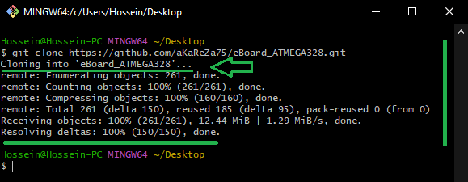
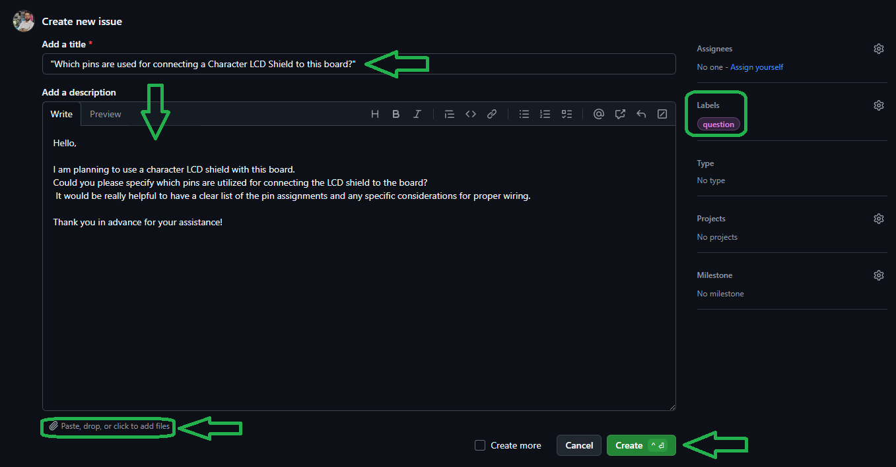

# Education_Boards
This repository contains educational resources and video tutorials on designing, assembling, and testing various educational boards for learning microcontrollers. Each board is designed from scratch, soldered, tested, and then used in tutorial videos. For example, we cover a USB to TTL converter from design to testing. These resources are ideal for electronics enthusiasts and learners aiming to deepen their understanding of microcontrollers.

To get familiar with the tutorial method, watch this video:
- [aKaReZa 25 - Microcontroller, Practical](https://youtu.be/5B_eDfAgxZU)  
  ---  
  In this video, we introduce the best method (based on my experience) for testing and practically implementing all the microcontroller courses on the channel. I explain the topic in detail using a practical example, and from now on, we will continue the microcontroller tutorials according to the contents of this video.

# 💻 How to Use Git and GitHub
First, open **Git Bash** :
-  Open the folder in **File Explorer** where you want the library to be stored.
-  **Right-click** inside the folder and select the option **"Open Git Bash here"** to open **Git Bash** in that directory.


> Note: If you do not see the "Open Git Bash here" option, it means that Git is not installed on your system.
> 
>  You can download and install Git from [this link](https://git-scm.com/downloads).
>  
>  For a tutorial on how to install and use Git, check out [this video](https://youtu.be/BsykgHpmUt8).
  
-  Once **Git Bash** is open, run the following command to clone the repository:

 ```bash
git clone https://github.com/aKaReZa75/Educational_Boards
```
- You can copy the above command by either:
- Clicking on the **Copy** button on the right of the command.
- Or select the command text manually and press **Ctrl + C** to copy.
- To paste the command into your **Git Bash** terminal, use **Shift + Insert**.


- Then, press Enter to start the cloning operation and wait for the success message to appear.



**Note:** Please keep in mind that the numbers displayed in the image might vary when you perform the same actions. This is because repositories are continuously being updated and expanded. Nevertheless, the overall process remains unchanged.

# USBtoTTL
- [aKaReZa 43 - PCB, USB to TTL](https://youtu.be/CHOmadm1B9U)  
  ---  
  In this video, we design a USB to TTL converter in a very simple, compact, and cost-effective manner based on a request from one of the channel’s respected viewers.

- [aKaReZa 51 - Repair, USB to TTL Soldering](https://youtu.be/JnmfULXj2iA)  
  ---  
  In this video, we solder and test the USB to UART converter that we designed. Additionally, we learned how to solder SMD ICs using two methods and covered important tips for testing the module.

# 7Segment Shield
- [aKaReZa 36 - PCB, 7Segment Shield - Part A](https://youtu.be/BtFFsqzkCSk)  
  ---  
  In this video, we design our first double-layer PCB. The board we design is an Arduino shield that includes a 7-segment display, push buttons, and an Oled display.

- [aKaReZa 40 - PCB, 7Segment Shield - Part B](https://youtu.be/yqlKacCi0RM)  
  ---  
  In this video, we examine the issues with the 7-segment and Oled Arduino shield we designed in the previous video, which was routed using Auto Route. We review the problems and discuss manual routing along with important tips to follow during manual routing.

- [aKaReZa 42 - Repair, Arduino 7Segment Shield Soldering](https://youtu.be/1Rpm_uHoqAg)  
  ---  
  In this video, we assemble the 7-segment and OLED shield we designed after printing it, and we learn several important tips about proper soldering techniques for SMD and THD components.

# ATMEGA328 Shield
- [aKaReZa 74 - eBoard, ATMEGA328 - PART A](https://youtu.be/-ttv7IQRaWA)  
  ---  
  This video is the first in a new series called eBoard, which stands for Educational Boards. In this video, we design the schematic for an educational header board specifically for the ATMEGA328 microcontroller used in the channel's tutorials.

- [aKaReZa 76 - eBoard, ATMEGA328 - PART B](https://youtu.be/Ipy6SqzdZnI)  
  ---  
  In this video, we fix a few issues in the schematic, upgrade and change several sections, and then transfer all components to the PCB. We arrange the components and prepare them for routing.

- [aKaReZa 88 - eBoard, ATMEGA328 - PART C](https://youtu.be/WwyNDgpCwrc)  
  ---  
  In this video, we complete the routing for the ATMEGA328 educational board and get familiar with related tips.

# 📝 How to Ask Questions
If you have any questions or issues, you can raise them through the **"Issues"** section of this repository. Here's how you can do it:  

1. Navigate to the **"Issues"** tab at the top of the repository page.  

  

2. Click on the **"New Issue"** button.  
   
  

3. In the **Title** field, write a short summary of your issue or question.  

4. In the "Description" field, detail your question or issue as thoroughly as possible. You can use text formatting, attach files, and assign the issue to someone if needed. You can also use text formatting (like bullet points or code snippets) for better readability.  

5. Optionally, you can add **labels**, **type**, **projects**, or **milestones** to your issue for better categorization.  

6. Click on the **"Submit new issue"** button to post your question or issue.
   
  

I will review and respond to your issue as soon as possible. Your participation helps improve the repository for everyone!  

**Tips**:  
- Before creating a new issue, please check the **"Closed"** section to see if your question has already been answered.  
     
- Write your question clearly and respectfully to ensure a faster and better response.  
- While the examples provided above are in English, feel free to ask your questions in **Persian (فارسی)** as well. There is no difference in how they will be handled!  

**Note:** Pages and interfaces may change over time, but the steps to create an issue generally remain the same.  

# 🤝 Contributing to the Repository
To contribute to this repository, please follow these steps:
1. **Fork the Repository**  
2. **Clone the Forked Repository**  
3. **Create a New Branch**  
4. **Make Your Changes**  
5. **Commit Your Changes**  
6. **Push Your Changes to Your Forked Repository**  
7. **Submit a Pull Request (PR)**  

Please ensure your pull request includes a clear description of the changes you’ve made. Once submitted, I will review your contribution and provide feedback if necessary.

# 🌟 Support Me
If you found this repository useful:
- Subscribe to my [YouTube Channel](https://www.youtube.com/@aKaReZa75).
- Share this repository with others.
- Give this repository and my other repositories a star.
- Follow my [GitHub account](https://github.com/aKaReZa75).

# 📜 License
This project is licensed under the GPL-3.0 License. This license grants you the freedom to use, modify, and distribute the project as long as you:
- Credit the original authors: Give proper attribution to the original creators.
- Disclose source code: If you distribute a modified version, you must make the source code available under the same GPL license.
- Maintain the same license: When you distribute derivative works, they must be licensed under the GPL-3.0 too.
- Feel free to use it in your projects, but make sure to comply with the terms of this license.
  
# ✉️ Contact Me
Feel free to reach out to me through any of the following platforms:
- 📧 [Email: aKaReZa75@gmail.com](mailto:aKaReZa75@gmail.com)
- 🎥 [YouTube: @aKaReZa75](https://www.youtube.com/@aKaReZa75)
- 💼 [LinkedIn: @akareza75](https://www.linkedin.com/in/akareza75)
